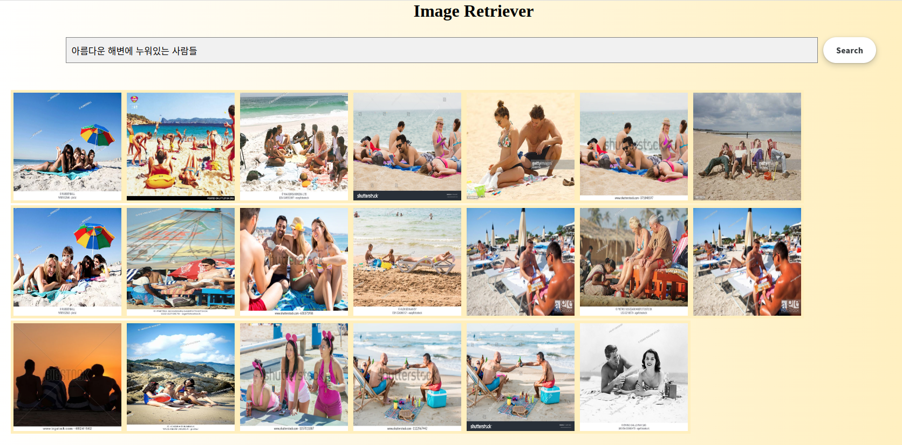

# Image retriever web server




## 빌드 도커 이미지

```bash
docker build -t keti/image_retriever_web_demo:v1 .
```

## 컨테이너 런


```bash
RETRIEVER_API_URL="http://your_retriever_ip:port/api/task"

docker run --gpus all --rm -it -p 8080:8080 \
-e RETRIEVER_API_URL=$RETRIEVER_API_URL \
--name image_retriever_web_demo \
keti/image_retriever_web_demo:v1
```

